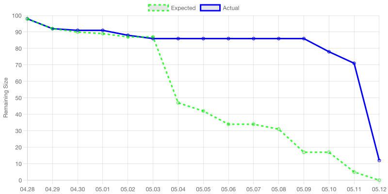

# Sprint 1 계획 회의 보고서

> Team 07
> 우현민, 곽승연, 조재표, 장호림, 문지환

## 스프린트 백로그 및 태스크 선정 이유

Sprint 1의 주요 목표는 팀의 개발 문화를 정립하는 것과 플레이 가능한 최소 사이즈의 게임을 제작하는 것이었습니다.

- 팀 문화 측면에서 Agile 을 적극적으로 도입하고자 하였습니다. Agile 의 실천 방식 중 "데이터를 많이 만들고 계기판을 통해 직원들이 자주 지나다니는 곳에 자주 노출할 것"이 있습니다. 본 프로젝트의 경우 물리적인 회사 공간은 없으므로 슬랙 채널을 통해 이를 달성하고자 하였고, 따라서 스크럼 슬랙봇을 제작하여 매일 아침마다 슬랙에 Burn Down Chart를 보냄으로써 이를 달성하였습니다.
- 또한 매 스프린트마다 동작하는 결과물을 제작함으로써 개발 프로세스가 잘 진행되고 있다는 것을 가시적으로 확인하고자 하였고, 이를 위해 그래픽, 사운드, 조작 모든 면에서 플레이 가능한 최소 사이즈의 게임을 제작하는 것을 목표로 하였습니다. 따라서 최소한의 그래픽을 적용할 수 있도록 주인공 에셋을 제작하는 태스크를, 최소한의 사운드를 확인할 수 있도록 기본 BGM을 적용하는 태스크를 잡았습니다.
- 본 게임은 맵의 완성도가 매우 중요하기 때문에 맵 제작에 많은 리소스를 집중해서 사용할 수 있도록, 팀원 한 분이 맵 제작 자동화를 전담해서 진행해주시기로 하였습니다.

세부적인 태스크 목록은 아래 태스크 할당 표 섹션에서 확인할 수 있습니다.

  

## 개인별 가용시간 체크

| 조원 | 가용시간 |
| --- | --- |
| 우현민 | 20시간 |
| 곽승연 | 30시간 |
| 조재표 | 30시간 |
| 장호림 | 20시간 |
| 문지환 | 30시간 |

  

## 태스크 할당 표

| 태스크 | 담당자 | 예상 소요 시간 |
| --- | --- | --- |
| 스프린트 1 계획 회의 준비 | 우현민 | 3 |
| 스프린트 1 계획 회의 진행 | 전체 | 2 |
| Unity Project 생성 | 장호림 | 0.5 |
| 스크럼 & 코드리뷰 리마인더 슬랙봇 | 우현민 | 1 |
| C# 코드 포매팅 CI workflow 구축 | 우현민 | 2 |
| 디자인 기본 컨셉 고민해서 공유 | 곽승연 | 1 |
| 맵 초안 제작 및 적용 | 조재표 | 40 |
| 게임 시작, 차량 및 카메라 시점 구현 | 문지환 | 1 |
| 게임 메인 화면 구현 | 문지환 | 1 |
| 닉네임 입력 구현 | 문지환 | 1 |
| 게임 일시중지 기능 구현 | 문지환 | 1 |
| Burn Down Chart 매일 아침 슬랙으로 전송 | 우현민 | 2 |
| 기본 배경 BGM 제작 및 적용 | 장호림 | 10 |
| 방향키를 통한 기본 조작 + 드리프트/부스터 구현 | 문지환 | 8 |
| 기본 차량 에셋 제작 및 적용 | 곽승연 | 5 |
| 주인공 에셋 제작 및 적용 | 곽승연 | 10 |
| 주변 행인 행동 구현 | 장호림 | 3 |
| 게임 플레이 기본 ui 구현 | 문지환 | 1 |
| 도착 지점 도착 시 게임 종료 후 종료 UI 보여주기 | 문지환 | 1 |
| 스프린트 1 회고 회의 준비 & 끝나고 보고서 작성 | 우현민 | 3 |
| 주변 행인 충돌 시 시작지점으로 이동 | 문지환 | 1 |
| 스프린트 1 회고 회의 진행 | 전체 | 2 |

     

# 일별 태스크 진행 요약

## 코드 및 에셋 커밋 기록

Sprint 1 기간인 4월 28일부터 5월 11일까지의 커밋 내역은 아래 링크에서 확인할 수 있습니다.

[https://github.com/SWPP-2025SPRING/team-project-for-2025-spring-swpp-team-07/commits/main/?since=2025-04-28&until=2025-05-11](https://github.com/SWPP-2025SPRING/team-project-for-2025-spring-swpp-team-07/commits/main/?since=2025-04-28&until=2025-05-11)

  

## 번다운 차트

     

# 스프린트 회고 회의 보고서

## 잘 된/안 된 부분에 대한 내용 정리 및 코멘트

- 먼저 개발에서 레퍼런스를 적절하게 찾아서 시간을 절약할 수 있었던 부분이 좋았다고 논의되었습니다. 반면 디자인 에셋을 만든 때에는 레퍼런스를 거의 활용하지 않았는데, 에셋을 직접 제작하는 데에 생각보다 너무 많은 시간이 소요되어서 다음 Sprint부터는 레퍼런스를 최대한 리서치해서 활용하기로 했습니다.

- Burndown Chart 에서도 확인할 수 있듯, 예상 일정과 실제 일정 사이의 간극이 꽤나 큰 상황임을 인지했습니다. 이번 Sprint 에서는 서로 작업 간에 병목이 있는 게 거의 없었어서 문제가 수면 위로 드러나지 않았지만, 다음 Sprint 부터는 작업간 병목이 있는 경우가 생길 것이라 예상 일정을 크게 벗어나지 않도록 진행하는 게 필요하다고 논의되었고, 최대한 예상 일정대로 진행하기로 하였습니다.

- 또한 가령 맵이나 에셋 제작 등에 문제점이 있을 때 적극적으로 공유되지 않다 보니 진행상황이 가시적으로 드러나지 않고 뒤늦게 문제가 발견되는 경우들이 있었는데, 이 점 역시 다음 Sprint 부터는 Slack을 더 적극적으로 활용하는 방향으로 개선하기로 논의했습니다.

- 마지막으로, 각자가 작업한 부분이 어떻게 적용된 것이고 변경사항을 어떻게 확인할 수 있는지 가시화되어 드러나지 않는 문제가 있어서, 기술적인 이슈로 Sprint 1에서 진행하진 않았던 Continuous Delivery 파이프라인 구축을 Sprint 2에서는 진행해 보기로 하였습니다.

  

## 프로덕트 백로그 우선순위 조정 기록

- `코드 포매팅 CI workflow 붙이기` Task의 경우 C# 진영에 에디터를 위한 Language Server 와 CI에서 사용하기 위한 CLI 툴을 모두 지원하는 적절한 도구가 없는 관계로 진행하지 않기로 결정했습니다.
- `주인공 에셋 제작 및 적용` Task의 경우 리소스 부족으로 스프린트 내에 진행하지 못했습니다. Sprint 2로 미뤘는데, 회고 결과 에셋을 직접 제작하는 건 생각보다 많은 시간이 소요된다는 것으로 파악되어서 Sprint 2에는 이미 존재하는 레퍼런스를 최대한 활용해보는 방향으로 접근 예정입니다.
