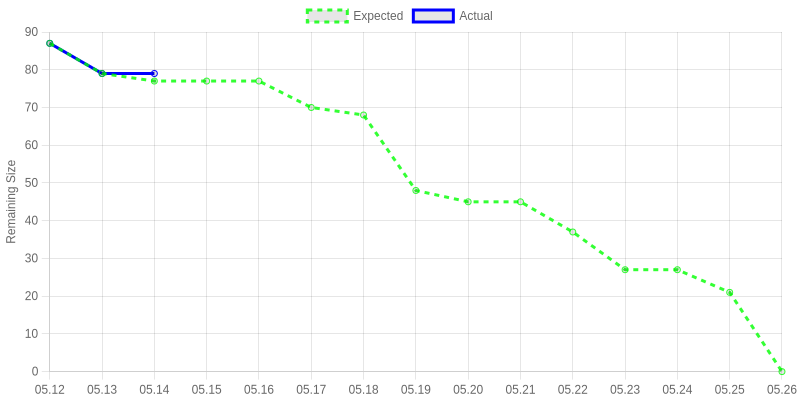

# Sprint 2 계획 회의 보고서

> Team 07 우현민, 곽승연, 조재표, 장호림, 문지환

  

## 스프린트 백로그 및 태스크 선정 이유

Sprint 2의 주요 목표는 ~~

- ~~
- ~~
- ~~

전체 태스크 목록은 아래 태스크 할당 표 섹션에서 확인할 수 있습니다.

  

## 개인별 가용시간 체크

| 조원 | 역할 | 가용시간 |
| --- | --- | --- |
| 우현민 | PM | 20시간 |
| 곽승연 | 디자인 | 30시간 |
| 조재표 | 맵제작 | 20시간 |
| 장호림 | 사운드, 개발 | 20시간 |
| 문지환 | 개발 | 20시간 |

  

## 태스크 할당 표

| 태스크 | 담당자 | 스토리 포인트 (소요시간) |
| --- | --- | --- |
| 스프린트 2 계획 회의 준비 | 우현민 | 3 |
| 스프린트 2 계획 회의 진행 | 전체 | 2 |
| 게임 종료 시 로컬에 기록 저장 구현 | 우현민 | 3 |
| 구현할 정확한 증강시스템 고민하고 작성해서 리뷰요청하기 | 우현민 | 3 |
| 배포 파이프라인 구축 | 우현민 | 3 |
| GameScene에 초기 맵 적용해두기 | 조재표 | 1 |
| 주변 차량 에셋 제작 및 적용 | 곽승연 | 7 |
| 맵 고도화: 사이즈 키우기 | 조재표 | 1 |
| 동료 픽업 체크포인트 구현 | 문지환 | 1 |
| 행인 충돌 시 이전 체크포인트로 이동 | 문지환 | 1 |
| 증강 시스템 1차 구현 | 문지환 | 5 |
| 미니맵 구현 | 장호림 | 3 |
| 주인공 에셋 1차 제작 및 적용 | 곽승연 | 5 |
| 맵 고도화: 수목 생성 | 조재표 | 7 |
| 주변 차량 행동 및 충돌 시 로직 구현 | 문지환 | 5 |
| 맵 고도화: 교차로 | 조재표 | 6 |
| 전체화면 맵 구현 | 장호림 | 4 |
| 기본 차량 적용하면서 고도화 | 곽승연 | 5 |
| 최종 증강: 비행 시스템 구현 | 문지환 | 4 |
| 특수 효과 BGM 제작 및 적용 | 장호림 | 6 |
| 맵 고도화: 보도블럭 | 조재표 | 7 |
| 스프린트 2 회고 회의 준비 & 끝나고 보고서 작성 | 우현민 | 3 |
| 스프린트 2 회고 회의 진행 | 전체 | 2 |

     

# Sprint 2 일별 태스크 진행 요약

> Team 07 우현민, 곽승연, 조재표, 장호림, 문지환

  

## 코드 및 에셋 커밋 기록

Sprint 2 기간인 5/12부터 5/25까지의 커밋 내역은 아래 링크에서 확인할 수 있습니다.

[(GitHub) 5/12 ~ 5/25 전체 커밋 기록](https://github.com/SWPP-2025SPRING/team-project-for-2025-spring-swpp-team-07/commits/main/?since=2025-05-12&until=2025-05-25)

  

## 번다운 차트 및 진행 내역

| 태스크 | 담당자 | 예상 시간 | 실제 시간 | 예상 일정 | 실제 일정 | 관련 링크 |
| --- | --- | --- | --- | --- | --- | --- |
| 나중에 | 복붙해서 | 넣을 | 예정 | 입 | 니 | 다 |

## 페어 프로그래밍 기록

| Driver | Navigator | 날짜 | 시간 | 작업 결과물 | 증빙 |
| --- | --- | --- | --- | --- | --- |
| 조재표 | 문지환 | 05-12 | 20:50-21:30 | [GitHub PR](https://github.com/SWPP-2025SPRING/team-project-for-2025-spring-swpp-team-07/pull/48) | [Slack Image](https://2025springswppimo.slack.com/files/U08HG6Q15NK/F08SM2LKC0G/img_3051.jpeg) |
| 문지환 | 조재표 | 05-12 | 19:40-20:20 | [GitHub PR](https://github.com/SWPP-2025SPRING/team-project-for-2025-spring-swpp-team-07/pull/45) | [Slack Image](https://2025springswppimo.slack.com/files/U08HG6Q15NK/F08SM2LKC0G/img_3051.jpeg) |
| 우현민 | 장호림 | 05-12 | 19:45-20:35 | [GitHub Commit](https://github.com/SWPP-2025SPRING/team-project-for-2025-spring-swpp-team-07/pull/46/commits/fa82d7e4c0112efd4977565f0990989386c818c5) | [Slack Image](https://2025springswppimo.slack.com/files/U08HG6Q15NK/F08S01REZUJ/img_1124.jpg) |
| 장호림 | 우현민 | 05-12 | 20:35-21:05 | [GitHub PR](https://github.com/SWPP-2025SPRING/team-project-for-2025-spring-swpp-team-07/pull/47) | [Slack Image](https://2025springswppimo.slack.com/files/U08HG6Q15NK/F08S01REZUJ/img_1124.jpg)

# Sprint 2 회고 회의 보고서

> Team 07 우현민, 곽승연, 조재표, 장호림, 문지환

  

## 잘 된/안 된 부분에 대한 내용 정리 및 코멘트

- TBD

  

## 프로덕트 백로그 우선순위 조정 기록

- TBD
