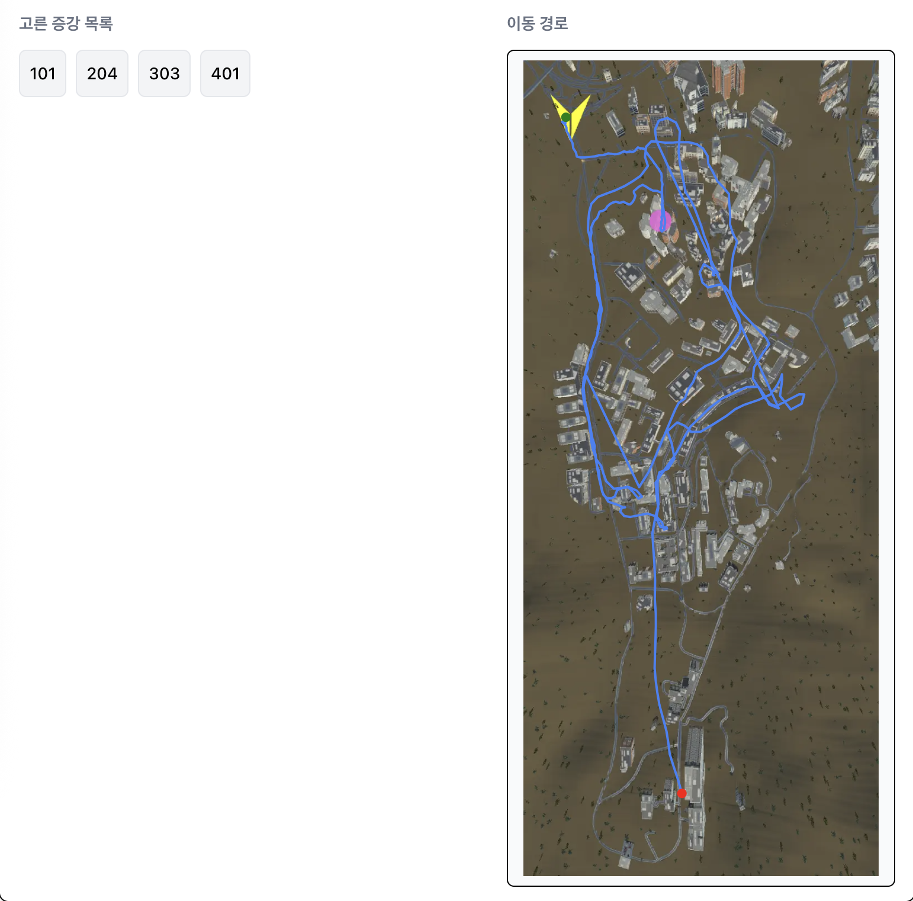

# Sprint 4 계획 회의 보고서

> Team 07 우현민, 곽승연, 조재표, 장호림, 문지환

<br/><br/>

## 스프린트 백로그 및 태스크 선정 이유

최종 스프린트이므로, 23일 발표 전까지 17시간 정도가 있긴 하지만 그 시간에는 발표자료를 만들어야 하므로 Sprint 4가 끝나기 전에 게임이 99% 이상 완성되어야 합니다. 따라서 잔여 태스크들을 모두 넣었고, 완성도를 높이기 위한 QA 작업을 포함했습니다.

#### 잔여 태스크들

- 행인과 차량은 게임의 재미에 있어 중요한 역할을 하는 주변 장애물들입니다.
  - 따라서 주변 행인과 차량이 자연스럽게 다녀야 하는데, 이 부분이 로직은 구현되어 있으나 아직 GameScene에 적용되지 않았습니다.
  - 또한 차량 충돌 시 로직이 구현되지 않은 상태였기에 해당 로직도 구현이 필요했습니다.
- 증강들 중 아직 미구현된 증강들이 있었습니다. 이런 증강들 구현을 마무리하는 작업이 필요했습니다.
- Sprint 4로 미뤄뒀던 랭킹 대시보드 태스크가 있었습니다. 게임에 대한 관심도를 높이고 게임 성적을 높이기 위해 필수적인 작업이므로 진행되어야 합니다.

#### QA와 크런치

- 지난 스프린트들 동안 일정이 다소 밀리게 되었기에 게임의 완성도를 크게 신경쓰지 못했습니다. 5명 중 3명이 6/20에 최종 발표가 있는 창의적통합설계 과목을 수강하고 있기도 하고, 다같이 모여서 진행하는 게 효율이 좋을 것 같아 게임업계의 전통과도 같은 크런치를 6월 20일~22일 주말에 진행하여 전 인원이 모여 게임의 완성도를 보완하기로 했고, QA 작업은 각각의 태스크를 미리 쪼개둘 수 없기에 팀 전체를 할당하여 20시간짜리 큰 태스크를 잡아두었습니다.

- QA 작업은 [GitHub Issue](https://github.com/SWPP-2025SPRING/team-project-for-2025-spring-swpp-team-07/issues) 를 통해 진행되며, 아래 프로세스를 따랐습니다.
   1. 개선점을 발견한 사람이 GitHub 에 Issue 등록하고
      - `Bug (버그)` / `Task (미구현된 작업)` / `Feature (추가 작업)` type 지정
      - 우선순위에 따라 `P0 (매우 중요)` / `P1 (중요)` / `P2 (되면 좋음)` label 지정
   2. PM이 현재 리소스를 보고 적절하게 팀원 Assign
   3. 진행 후 Assignee가 PR을 올리며 GitHub의 [Closing Keyword](https://docs.github.com/en/get-started/writing-on-github/working-with-advanced-formatting/using-keywords-in-issues-and-pull-requests) 기능을 활용하여 해당 Issue와 PR을 연결

#### 기타

기타 계획 회의 준비 및 진행, 회고 회의 준비 및 진행, 스프린트 보고서 작성 태스크 역시 개인별 가용 시간에 고려해야 했기에 태스크로 잡아뒀습니다.

<br/><br/>

## 개인별 가용시간 체크

| 조원 | 역할 | 가용시간 |
| --- | --- | --- |
| 우현민 | PM | 50시간 |
| 곽승연 | 디자인 | 50시간 |
| 조재표 | 맵제작 | 40시간 |
| 장호림 | 사운드, 개발 | 50시간 |
| 문지환 | 개발 | 35시간 |

<br/><br/>

## 태스크 할당 표

| 태스크 | 담당자 | 스토리 포인트 (소요시간) |
| --- | --- | --- |
| 스프린트 4 계획 회의 진행 | 전체 | 1 |
| 제작한 맵 GameScene에 적용 | 문지환,우현민,조재표 | 3 |
| 행인 및 주변 차량 로직 GameScene에 적용 | 문지환,조재표 | 8 |
| 행인 및 주변 차량 관련 증강 구현 | 우현민 | 5 |
| 차량 충돌 시 로직 | 장호림 | 2 |
| 특수 효과 BGM 적용 | 장호림 | 3 |
| 랭킹 대시보드 ui 및 저장된 기록 보여주기 구현 | 우현민 | 8 |
| 전체적인 ui 디자인 다듬기 | 곽승연 | 5 |
| 속도/가속도 관련 증강 구현 | 곽승연 | 2 |
| GameScene에 적용된 전체화면 맵 재구현 | 장호림 | 2 |
| 맵: 미니맵 지원 및 완성 | 장호림,조재표 | 3 |
| 비행 증강 적용 | 곽승연 | 4 |
| QA | 전체 | 20 |
| 맵: 스카이박스 적용 | 조재표 | 3 |
| 스프린트 4 보고서 작성 | 우현민 | 4 |
| 스프린트 4 회고 회의 진행 | 전체 | 1 |

<br/><br/><br/><br/><br/>

# Sprint 4 일별 태스크 진행 요약

> Team 07 우현민, 곽승연, 조재표, 장호림, 문지환

<br/><br/>

## 코드 및 에셋 커밋 기록

Sprint 4 기간인 6/09부터 6/22까지의 커밋 내역은 아래 링크에서 확인할 수 있습니다.

[(GitHub) 6/09 ~ 6/22 전체 커밋 기록](https://github.com/SWPP-2025SPRING/team-project-for-2025-spring-swpp-team-07/commits/main/?since=2025-06-09&until=2025-06-22)

<br/><br/>

## 번다운 차트 및 진행 내역

#### 번다운 차트


#### 세부 진행 내역

| 태스크 | 담당자 | 예상 시간 | 실제 시간 | 예상 일정 | 실제 일정 | 관련 링크 |
| --- | --- | --- | --- | --- | --- | --- |
| 스프린트 4 계획 회의 진행 | 전체 | 1 | 9일 → 9일 | 1 | 9일 → 9일 | - |
| 제작한 맵 GameScene에 적용 | 문지환,우현민,조재표 | 3 | 9일 → 9일 | 2 | 9일 → 9일 | [PR #93](https://github.com/SWPP-2025SPRING/team-project-for-2025-spring-swpp-team-07/pull/93) |
| 랭킹 대시보드 ui 및 저장된 기록 보여주기 구현 | 우현민 | 8 | 16일 → 20일 | 8 | 9일 → 15일 | [PR#96](https://github.com/SWPP-2025SPRING/team-project-for-2025-spring-swpp-team-07/pull/96), [PR#97](https://github.com/SWPP-2025SPRING/team-project-for-2025-spring-swpp-team-07/pull/101), [PR#112](https://github.com/SWPP-2025SPRING/team-project-for-2025-spring-swpp-team-07/pull/112) |
| 행인 및 주변 차량 로직 GameScene에 적용 | 문지환,조재표 | 8 | 11일 → 14일 | 7 | 12일 → 13일 | [PR #93](https://github.com/SWPP-2025SPRING/team-project-for-2025-spring-swpp-team-07/pull/93), [PR #101](https://github.com/SWPP-2025SPRING/team-project-for-2025-spring-swpp-team-07/pull/101) |
| 차량 충돌 시 로직 | 장호림 | 2 | 13일 → 13일 | 1 | 16일 → 16일 | [PR #104](https://github.com/SWPP-2025SPRING/team-project-for-2025-spring-swpp-team-07/pull/104) |
| 속도/가속도 관련 증강 구현 | 곽승연 | 2 | 16일 → 16일 | 2 | 17일 → 17일 | [PR #105](https://github.com/SWPP-2025SPRING/team-project-for-2025-spring-swpp-team-07/pull/105) |
| 전체적인 ui 디자인 다듬기 | 곽승연 | 5 | 16일 → 20일 | 15 | 18일 → 22일 | [PR#160](https://github.com/SWPP-2025SPRING/team-project-for-2025-spring-swpp-team-07/pull/160), [PR#184](https://github.com/SWPP-2025SPRING/team-project-for-2025-spring-swpp-team-07/pull/184) |
| GameScene에 적용된 전체화면 맵 재구현 | 장호림 | 2 | 16일 → 16일 | 2 | 21일 → 21일 | [PR#165](https://github.com/SWPP-2025SPRING/team-project-for-2025-spring-swpp-team-07/pull/165) |
| 특수 효과 BGM 적용 | 장호림 | 3 | 15일 → 15일 | 3 | 19일 → 22일 | [PR#173](https://github.com/SWPP-2025SPRING/team-project-for-2025-spring-swpp-team-07/pull/173) |
| 맵: 스카이박스 적용 | 조재표 | 3 | 21일 → 21일 | 4 | 21일 → 21일 | [PR#153](https://github.com/SWPP-2025SPRING/team-project-for-2025-spring-swpp-team-07/pull/153) |
| 행인 및 주변 차량 관련 증강 구현 | 장호림 | 5 | 13일 → 13일 | 3 | 22일 → 22일 | [PR#194](https://github.com/SWPP-2025SPRING/team-project-for-2025-spring-swpp-team-07/pull/194) |
| QA | 전체 | 20 | 21일 → 22일 | 20 | 20일 → 22일 | [Issue#180](https://github.com/SWPP-2025SPRING/team-project-for-2025-spring-swpp-team-07/issues/180) -> [PR#182](https://github.com/SWPP-2025SPRING/team-project-for-2025-spring-swpp-team-07/pull/182) 등 |
| 스프린트 4 보고서 작성 | 우현민 | 3 | 22일 → 22일 | 6 | 20일 → 22일 | - |
| 스프린트 4 회고 회의 진행 | 전체 | 1 | 22일 → 22일 | 1 | 22일 → 22일 | - |

QA 태스크의 경우 [Issue#128](https://github.com/SWPP-2025SPRING/team-project-for-2025-spring-swpp-team-07/issues/128) -> [PR#171](https://github.com/SWPP-2025SPRING/team-project-for-2025-spring-swpp-team-07/pull/171), [Issue#180](https://github.com/SWPP-2025SPRING/team-project-for-2025-spring-swpp-team-07/issues/180) -> [PR#182](https://github.com/SWPP-2025SPRING/team-project-for-2025-spring-swpp-team-07/pull/182) 등등이 있는데 총 20개 내외로 그 수가 너무 많아 모든 링크를 첨부하지는 않았습니다. [Close된 이슈 목록](https://github.com/SWPP-2025SPRING/team-project-for-2025-spring-swpp-team-07/issues?q=is%3Aissue%20state%3Aclosed) 에서 처리 완료된 QA 태스크 목록을 확인할 수 있습니다.

<br/><br/>

## 페어 프로그래밍 기록

| 내용 | Driver | Navigator | 날짜 | 시간 | 작업 결과물 | 증빙 |
| --- | --- | --- | --- | --- | --- | --- |
| `속도 및 가속도 관련 증강 구현` 중 201 증강 구현 | 곽승연 | 우현민 | 06-09 | 18:01-18:50 | [PR#91](https://github.com/SWPP-2025SPRING/team-project-for-2025-spring-swpp-team-07/pull/91) | [Slack Image](https://2025springswppimo.slack.com/archives/C08KVGJU4H4/p1750065956411959?thread_ts=1749460069.351659&cid=C08KVGJU4H4) |
| `랭킹 대시보드` 작업 중 저장장소 FS -> MongoDB 변경 작업 | 우현민 | 곽승연 | 06-09 | 18:50-19:23 | [PR#92 Commit](https://github.com/SWPP-2025SPRING/team-project-for-2025-spring-swpp-team-07/pull/92/commits/3ab8c0a8fcfc3c4955fa9d0da9140de7c090d892) | [Slack Image](https://2025springswppimo.slack.com/archives/C08KVGJU4H4/p1750065956411959?thread_ts=1749460069.351659&cid=C08KVGJU4H4) |
| `제작한 Map GameScene에 적용` 태스크 중 적용 작업 | 조재표 | 문지환 | 06-09 | 18:00-19:25 | [PR#72](https://github.com/SWPP-2025SPRING/team-project-for-2025-spring-swpp-team-07/pull/72) | [Slack Image](https://2025springswppimo.slack.com/archives/C08KVGJU4H4/p1750066127350699?thread_ts=1749460069.351659&cid=C08KVGJU4H4) |
| `제작한 Map GameScene에 적용` 태스크 중 마무리 작업 | 우현민 | 조재표,곽승연 | 06-09 | 19:25-19:55 | [PR#72](https://github.com/SWPP-2025SPRING/team-project-for-2025-spring-swpp-team-07/pull/72) | [Slack Image](https://2025springswppimo.slack.com/archives/C08KVGJU4H4/p1750066127350699?thread_ts=1749460069.351659&cid=C08KVGJU4H4) |
| `행인 및 주변 차량 관련 로직 GameScene에 적용` 태스크 중 주변차량로직 적용 | 문지환 | 조재표 | 06-12 | 15:00-20:00 | [PR#93](https://github.com/SWPP-2025SPRING/team-project-for-2025-spring-swpp-team-07/pull/93) | [Slack Image](https://2025springswppimo.slack.com/archives/C08KVGJU4H4/p1749899470080349?thread_ts=1749783423.267939&cid=C08KVGJU4H4) |
| `차량 충돌 시 로직` 태스크, `특수 효과 BGM 적용` 태스크 중 충돌 시 BGM | 장호림 | 곽승연 | 06-16 | 17:35-18:45 | [GitHub PR#104](https://github.com/SWPP-2025SPRING/team-project-for-2025-spring-swpp-team-07/pull/104) | [Slack Image](https://2025springswppimo.slack.com/archives/C08KVGJU4H4/p1750068777505649?thread_ts=1750042878.743469&cid=C08KVGJU4H4) |
| `행인 및 주변 차량 로직 GameScene에 적용` 태스크 중 행인로직 완성 | 우현민 | 문지환 | 06-16 | 17:35-17:54 | [PR#101](https://github.com/SWPP-2025SPRING/team-project-for-2025-spring-swpp-team-07/pull/101) | [Slack Image](https://2025springswppimo.slack.com/archives/C08KVGJU4H4/p1750066757689789?thread_ts=1750064039.918209&cid=C08KVGJU4H4) |

# Sprint 4 회고 회의 보고서

> Team 07 우현민, 곽승연, 조재표, 장호림, 문지환

<br/><br/>

## KPT 정리

다음 스프린트가 실제로는 없지만, Keep 과 Try 를 작성하는 것 자체만으로도 의미를 가지므로 다음 스프린트가 있다고 가정하고 KPT를 작성했습니다.

<table>
  <thead>
    <tr>
      <th>사람</th>
      <th>Keep</th>
      <th>Problem</th>
      <th>Try</th>
    </tr>
  </thead>
  <tbody>
    <tr>
      <td>우현민</td>
      <td>모여서 다같이 정해진 시간에 페어프로그래밍을 진행하는 것. 확실히 개발 효율이 훨씬 높았다. </td>
      <td>신경쓰지 않으면 계속 PR Size가 커졌고, 그 결과 Conflict가 예상보다는 자주 발생했다.</td>
      <td>더 작은 PR을 더 자주 하기, Formatting 관련 이슈가 발생하지 않도록 Formatting을 CI에 통합하기</td>
    </tr>
    <tr>
      <td>곽승연</td>
      <td>가능한 시간을 모두 태스크 수행에 투자하였다.</td>
      <td>스프린트 1,2,3에서도 이렇게 했으면 더 좋을 것 같다.</td>
      <td>디자인에 미리캔버스를 사용했는데, 확장성이 낮아 불편했음. 더 다양한 디자인 툴 배워두기</td>
    </tr>
    <tr>
      <td>조재표</td>
      <td>크런치를 통해 다같이 소통을 하며 개발하니 효율이 높았다.</td>
      <td>개발을 빠르고 급하게 하다 보니 다른 사람들이 무슨 태스크를 하고 있는지 놓칠 때가 있었다.</td>
      <td>작은 회의를 자주 시도해보기</td>
    </tr>
    <tr>
      <td>장호림</td>
      <td>개발을 빠르게 할 수 있었다. 하나의 큰 push 를 하는 것보다 자주 조금씩 push하니 훨씬 협업에 용이하였다.</td>
      <td>하지만 그럼에도 브랜치를 머지할 때 Conflict 가 자주 발생하였다.</td>
      <td>Scene은 가능한 한 건드리지 않는 게 좋음. 그리고 제거나 수정보다는 추가를 하는 게 좋다</td>
    </tr>
  </tbody>
</table>

<br/><br/>

## 프로덕트 백로그 우선순위 조정 기록

- `비행 증강 적용` 태스크의 경우 만들어진 비행 모듈의 조작감이 좋지 않고, 해당 증강을 모두 모았으면 기본 차량 에셋도 속도가 빨라서 사실상 비행 모드로 돌입이 가능하여 따로 태스크로 빼지 않고 지금 구현된 상태를 사용하기로 했습니다.
- `행인 및 주변 차량 증강 구현` 태스크의 경우 QA 과정에서의 리소스 재분배에 따라 Assignee 가 우현민 -> 장호림 학생으로 변경되었습니다.
- `맵: 미니맵 지원 및 완성` 태스크의 경우 별도 태스크가 필요할 것으로 예상했으나 이미 잘 동작해서 태스크를 없앴습니다.

<br/><br/>

## 총평

<br/><br/><br/><br/><br/>

# 스프린트 추가내용

Sprint 4에서의 추가 작성 내용은 디자인 패턴, 테스팅, 리팩토링입니다.

## 디자인 패턴

Sprint 4에서는 개발의 틀을 잡기보다는 리팩토링과 디테일을 잡는 것에 많은 리소스를 들였기에, 디자인 패턴을 적극적으로 차용하지는 않았습니다.

### 전체 맵의 resizing 로직 구현: Memento Pattern

m 키를 눌러 진입할 수 있는 전체화면 맵은 +/- 키와 방향키로 확대/축소/이동할 수 있습니다. 이때 맵을 껐다가 다시 켜면 초기 상태로 돌아가 있어야 하는데, 이를 위해 초기값을 수정할 수 없는 상수로 정의하여 memento pattern을 적용했습니다. [FullMapController.cs](https://github.com/SWPP-2025SPRING/team-project-for-2025-spring-swpp-team-07/blob/6733ea528e9fdd18634c3fcc6f871b1a5ccaeea4/SchoolRush/Assets/Scripts/GameController/FullMapController.cs#L8) 에서 로직을 확인할 수 있습니다.

```csharp
    private Vector3 pos0 = new(0, 3829, -454);
    private const float fov0 = 80f;
    private void Init()
    {
        transform.position = pos0;
        cam.fieldOfView = fov0;
    }
```

이렇게 항상 Init()을 수행함으로서 초기값으로 안정적으로 되돌릴 수 있었습니다.

Memento Pattern 을 적용하지 않고 Command Pattern 같은 걸 활용했더라면, 매번 맵을 종료할 때마다 역산해서 스케일을 조정해줬어야 했을 텐데 이렇게 하면 버그가 발생할 가능성이 높아 결함율이 높았을 것 같습니다. Memento Pattern 덕분에 더 안정적으로 코드를 유지할 수 있었습니다.

## 테스팅

진행한 테스트들 중 대표적인 테스트 사례 두 가지를 소개합니다.

### RandomPicker Pick Count Logic Test

- 환경: Mac OS X, Windows, Ubuntu
   - 단위 테스트인데, 각 팀원의 로컬 기기 (Mac OS X, Windows) 및 CI 머신 (Ubuntu) 에서 돌립니다.
- 목적: Functional Testing
- 범위: Unit Test
- 방법: Automated ([CI File](https://github.com/SWPP-2025SPRING/team-project-for-2025-spring-swpp-team-07/blob/6733ea528e9fdd18634c3fcc6f871b1a5ccaeea4/.github/workflows/unit-test.yml#L1-L26))
- 테스트하는 이유
   - 지난 스프린트 3에서 구현했던 테스트인데, Sprint 4로 넘어오며 해당 모듈의 역할이 더 많아질 수 있게 되었습니다.
   - 기존에는 3개를 pick하는 경우만 테스트했었으나 실제 용례를 보면 1개부터 3개까지를 모두 사용하고 있습니다.
   - 이에 기존 테스트케이스들에 더해 1개를 pick하는 테스트케이스를 추가했습니다. 모듈의 안정성을 보완해주면서 모듈에 대해 기대하는 동작의 문서가 되어 주길 기대합니다.
- 테스트 스펙 결정 이유
   - Automated Test가 깔끔하게 가능하다면, 사람의 리소스를 아끼고 실수 여지를 줄이기 위해 Automated test를 하는 것이 더 좋습니다.
   - dotnet test 를 활용하면 아주 빠르게 단위 모듈에 대한 자동화 테스트를 진행할 수 있습니다.
   - 또한 이를 CI에 통합하면, CI 서버에서 자동으로 테스트를 진행할 수 있습니다.
- 테스트 결과
   - [CI#15807641757 run result](https://github.com/SWPP-2025SPRING/team-project-for-2025-spring-swpp-team-07/actions/runs/15807641757/job/44554645920) 에서 실행 결과 자동화 테스트가 통과했음을 확인할 수 있습니다.

<br/><br/>

### Player Data Save Logic Test

- 환경: Builded Application, Local (Mac OS X)
   - Windows 에서도 동일하게 동작할 것으로 기대하고 따로 테스트하지 않았습니다.
- 목적: Functional Testing
- 범위: E2E Test
- 방법: Manual
- 테스트하는 이유
   - 랭킹 대시보드에 플레이 데이터가 올라가는 기능은 매우 핵심적인 게임의 재미 요소이므로 정상 동작을 보장해야 하므로 테스트합니다.
- 테스트 스펙 결정 이유
   - Player Data 에는 MainScene에서 저장한 닉네임, GameSceneWithMap 에서 저장한 증강 id들과 주행 기록이 모두 포함되고, 저장 시점은 게임을 클리어했을 때이므로 이 기능은 전체 플로우에 모두 걸쳐 있습니다.
   - 이에 따라 단위 테스트보다는 전체 로직을 통합해서 확인할 수 있는 e2e 테스트가 가장 적합하다고 판단했습니다.
   - 또한, 증강 목록이 random하게 뜨기 때문에 자동화를 하기 어렵고, 자동화를 억지로 하더라도 신뢰성을 보장할 수 없기에 Manual 테스트를 선택했습니다.
- 테스트케이스
   - Given: Mac OS X 에서 빌드된 어플리케이션을 다운로드받은 플레이어
   - And: 랭킹 대시보드에 아무 데이터도 없는 상태
   - When: 어플리케이션을 열고 닉네임 입력
   - And: 닉네임란에 `woohm402` 라고 입력
   - And: 게임 시작 버튼을 눌러 게임 씬으로 진입
   - And: 체크포인트 1, 2, 3, 4, 5를 거쳐 각 스텝에서 원하는 증강을 골라 도착지점에 도착
   - Then: 게임 종료 ui에서 최종 소요 시간을 조회할 수 있음
   - Then: [랭킹 대시보드](https://schoolrush.vercel.app) 에 접속하면 내가 입력한 닉네임 `woohm402` 와 내가 고른 증강 목록, 최종 소요 시간, 해당 데이터가 정확하게 오차 없이 조회됨
- 특이사항
   - 랭킹 대시보드에는 상위 10개의 데이터만 뜨게 되므로, 데이터가 꽉 차 있는 상태에서 테스트를 진행했다가 상위 10등 안에 들지 못하면 대시보드에서 방금의 결과를 조회하지 못할 수 있었습니다. 이에 아무 데이터도 없는 상태에서 e2e 테스트를 진행해야 했기에 대시보드 DB를 초기화하고 테스트를 진행했습니다.
- E2E 테스트 결과 캡쳐



## 리팩토링

### Checkpoint 관련 리팩토링

자세한 변경사항은 [PR#198](https://github.com/SWPP-2025SPRING/team-project-for-2025-spring-swpp-team-07/pull/198)에서 확인할 수 있으며, 보고서에 작성한 내용과 PR Description이 유사하지만 보고서에는 이유와 이후 개선된 점에 대해 더 많이 서술했습니다.

#### Problems

- `CheckpointManager`와 `CollisionManager` 스크립트가 둘 다 Kart의 Collider 에 붙어 있었고 이에 따라 충돌 로직이 둘 모두에 붙게 되어 충돌에 대한 각 모듈의 책임이 명확하게 분리되지 않고 있었습니다.
- `nextCheckpointID` 를 저장하는 로직은 KartController 에 있고 checkpoint 들을 activate/deactivate 시키는 로직은 `CheckpointManager` 에 있어서 checkpoint 관련 로직의 응집도가 떨어져 있었습니다.

이에 DRY 원칙과 SOLID 원칙이 위배되었다고 판단했고, 3의 법칙에도 해당되게 되어 리팩토링을 진행했습니다.

#### Changes

- 우선 `CheckpointManager` Script 를 Kart 의 Collider 에서 `GameManager` GameObject 로 옮겨서 CheckpointManager 가 충돌에 관여하지 않게 수정했습니다.
- 또한 nextCheckpointID 를 KartController 의 필드에서 CheckpointManager 의 필드로 변경했습니다.

#### Pros

- SRP (단일 책임 원칙)
   - KartController 가 속도와 부스트들 관련 로직도 액터로 가지고 checkpoint 도 액터로 가지는 상태였는데, nextCheckpointID 를 CheckpointManager 로 모음으로써 KartController 의 SRP을 개선했습니다. 이제 checkpoint 관련 기획 수정 때문에 KartController가 영향을 받아 Conflict 가 발생할 일은 없었습니다. 또한 다음 체크포인트 ID는 멀티플레이 게임이 되지 않는 한, 카트에 종속된 값이 아닌 게임에 종속된 값이므로 역할 구분도 더 명확해졌습니다.
   - `CheckpointManager` 가 체크포인트도 액터로 가지고 충돌 관련 로직도 액터로 가지고 있었는데, CheckpointManager 에서 충돌 관련 로직을 떼어냄으로써 CheckpointManager 가 체크포인트 기획만 액터로 가지게 되었습니다. 이제 충돌 로직 수정 때문에 체크포인트 로직이 꼬이는 상황은 발생하지 않게 되었습니다.
- DRY (중복 금지) 및 Encapsulation (캡슐화)
   - checkpointManager 가 checkpoint 목록을 배열로 관리하고, KartController 내부에 nextCheckpointID 가 있고, CollisionManager 가 그 사이에서 조율을 하다 보니 `checkpoint의 목록이 0부터 시작하는 배열로 관리된다` 라는 지식의 중복이 발생하고 있었는데, checkpointManager 에 checkpoint 목록을 캡슐화시키고 `GetNextCheckpointID()`, `GetPreviousCheckpointID()`, `OnEnterCheckpoint(int checkpoint)` 이렇게 세 개의 메서드만 외부에 공개함으로써 해당 지식이 `CheckpointManager` 에만 존재하게 처리했습니다. 이를 통해 checkpoint 목록이 배열로 관리되든, List 로 관리되든, 별도의 6개 변수로 관리되든 해당 지식은 `CheckpointManager` 모듈에만 존재하기에 해당 방식이 변경되어도 외부 로직은 전혀 변경할 필요가 없게 되었습니다.

#### Result

- Checkpoint 관련 로직을 수정할 때마다 KartController, CollisionManager, CheckpointManager 를 모두 검사하며 예상치 못한 side effect가 없을지 걱정했어야 했는데, 리팩토링 이후 코드를 수정할 때 한결 편해졌습니다.

<br/><br/>

### KartController 필드 리팩토링

자세한 변경사항은 [PR#114](https://github.com/SWPP-2025SPRING/team-project-for-2025-spring-swpp-team-07/pull/114)에서 확인할 수 있습니다.

#### Problem

기존에 KartController의 필드값들 (최고 속도 등)을 inspector 에서 할당하고 있었습니다. 하지만 inspector 에서 할당한 값은 Git에서 조회했을 때 200만줄이 넘는 파일인 `GameSceneAndMap.unity` 에 반영되었고, 따라서 diff를 확인하기도 힘들 뿐더러 값을 수정할 경우 conflict 도 자주 발생했습니다.

이런 문제가 반복되어 리팩토링을 결정했습니다.

#### Changes

KartController의 필드들을 모두 private 으로 변경하여 inspector 에 노출되지 않게 했고, 이를 통해 inspector에서 값을 수정할 가능성을 원천 차단했습니다. PR에는 이외에 코드의 필드들을 정리하는 체인지도 포함되어 있지만, 이 변경이 핵심이었습니다.

#### Result

변경 결과 KartController의 값을 inspector 에서 수정하여 conflict가 나는 상황이 사라졌습니다. 또한 증강을 구현하며 최고 속도나 가속도를 코드로서 수정할 일들이 많이 생겼는데 이런 부분에도 대응할 수 있었고, 이런 수치들은 가능한 inspector 대신 C# 스크립트를 활용해야겠다고 느꼈습니다.
