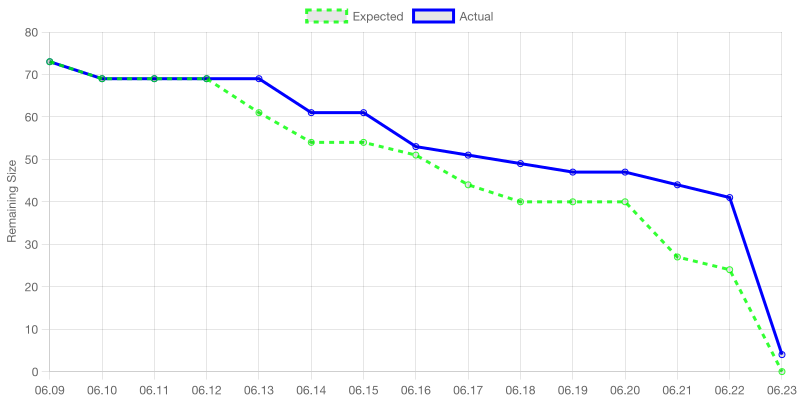

# Sprint 4 계획 회의 보고서

> Team 07 우현민, 곽승연, 조재표, 장호림, 문지환

  

## 스프린트 백로그 및 태스크 선정 이유

최종 스프린트이므로, 23일 발표 전까지 17시간 정도가 있긴 하지만 그 시간에는 발표자료를 만들어야 하므로 Sprint 4가 끝나기 전에 게임이 99% 이상 완성되어야 합니다. 따라서 잔여 태스크들을 모두 넣었고, 완성도를 높이기 위한 QA 작업을 포함했습니다.

#### 잔여 태스크들

- 행인과 차량은 게임의 재미에 있어 중요한 역할을 하는 주변 장애물들입니다.
  - 따라서 주변 행인과 차량이 자연스럽게 다녀야 하는데, 이 부분이 로직은 구현되어 있으나 아직 GameScene에 적용되지 않았습니다.
  - 또한 차량 충돌 시 로직이 구현되지 않은 상태였기에 해당 로직도 구현이 필요했습니다.
- 증강들 중 아직 미구현된 증강들이 있었습니다. 이런 증강들 구현을 마무리하는 작업이 필요했습니다.
- Sprint 4로 미뤄뒀던 랭킹 대시보드 태스크가 있었습니다. 게임에 대한 관심도를 높이고 게임 성적을 높이기 위해 필수적인 작업이므로 진행되어야 합니다.

#### QA와 크런치

- 지난 스프린트들 동안 일정이 다소 밀리게 되었기에 게임의 완성도를 크게 신경쓰지 못했습니다. 5명 중 3명이 6/20에 최종 발표가 있는 창의적통합설계 과목을 수강하고 있기도 하고, 다같이 모여서 진행하는 게 효율이 좋을 것 같아 게임업계의 전통과도 같은 크런치를 6월 20일~22일 주말에 진행하여 전 인원이 모여 게임의 완성도를 보완하기로 했고, QA 작업은 각각의 태스크를 미리 쪼개둘 수 없기에 팀 전체를 할당하여 20시간짜리 큰 태스크를 잡아두었습니다.

- QA 작업은 [GitHub Issue](https://github.com/SWPP-2025SPRING/team-project-for-2025-spring-swpp-team-07/issues) 를 통해 진행되며, 아래 프로세스를 따랐습니다.
   1. 개선점을 발견한 사람이 GitHub 에 Issue 등록하고, `Bug (버그)` / `Task (미구현된 작업)` / `Feature (추가 작업)` 타입 지정
   2. PM이 현재 리소스를 보고 적절하게 팀원 Assign
   3. 진행 후 Assignee가 PR을 올리며 GitHub의 [Closing Keyword](https://docs.github.com/en/get-started/writing-on-github/working-with-advanced-formatting/using-keywords-in-issues-and-pull-requests) 기능을 활용하여 해당 Issue와 PR을 연결

#### 기타

기타 계획 회의 준비 및 진행, 회고 회의 준비 및 진행, 스프린트 보고서 작성 태스크 역시 개인별 가용 시간에 고려해야 했기에 태스크로 잡아뒀습니다.

  

## 개인별 가용시간 체크

| 조원 | 역할 | 가용시간 |
| --- | --- | --- |
| 우현민 | PM | 50시간 |
| 곽승연 | 디자인 | 50시간 |
| 조재표 | 맵제작 | 40시간 |
| 장호림 | 사운드, 개발 | 50시간 |
| 문지환 | 개발 | 35시간 |

  

## 태스크 할당 표

| 태스크 | 담당자 | 스토리 포인트 (소요시간) |
| --- | --- | --- |
| 스프린트 4 계획 회의 진행 | 전체 | 1 |
| 제작한 맵 GameScene에 적용 | 문지환,우현민,조재표 | 3 |
| 행인 및 주변 차량 로직 GameScene에 적용 | 문지환,조재표 | 8 |
| 행인 및 주변 차량 관련 증강 구현 | 우현민 | 5 |
| 차량 충돌 시 로직 | 장호림 | 2 |
| 특수 효과 BGM 적용 | 장호림 | 3 |
| 랭킹 대시보드 ui 및 저장된 기록 보여주기 구현 | 우현민 | 8 |
| 전체적인 ui 디자인 다듬기 | 곽승연 | 5 |
| 속도/가속도 관련 증강 구현 | 곽승연 | 2 |
| GameScene에 적용된 전체화면 맵 재구현 | 장호림 | 2 |
| 맵: 미니맵 지원 및 완성 | 장호림,조재표 | 3 |
| 비행 증강 적용 | 곽승연 | 4 |
| QA | 전체 | 20 |
| 맵: 스카이박스 적용 | 조재표 | 3 |
| 스프린트 4 보고서 작성 | 우현민 | 4 |
| 스프린트 4 회고 회의 진행 | 전체 | 1 |

     

# Sprint 4 일별 태스크 진행 요약

> Team 07 우현민, 곽승연, 조재표, 장호림, 문지환

  

## 코드 및 에셋 커밋 기록

Sprint 4 기간인 6/09부터 6/22까지의 커밋 내역은 아래 링크에서 확인할 수 있습니다.

[(GitHub) 6/09 ~ 6/22 전체 커밋 기록](https://github.com/SWPP-2025SPRING/team-project-for-2025-spring-swpp-team-07/commits/main/?since=2025-06-09&until=2025-06-22)

  

## 번다운 차트 및 진행 내역

#### 번다운 차트

#### 세부 진행 내역

| 태스크 | 담당자 | 예상 시간 | 실제 시간 | 예상 일정 | 실제 일정 | 관련 링크 |
| --- | --- | --- | --- | --- | --- | --- |
| 스프린트 4 계획 회의 진행 | 전체 | 1 | 9일 → 9일 | 1 | 9일 → 9일 | [Slack File](https://2025springswppimo.slack.com/archives/C08KGHK9XA5/p1750582892405659) |
| 제작한 맵 GameScene에 적용 | 문지환,우현민,조재표 | 3 | 9일 → 9일 | 2 | 9일 → 9일 | [PR #93](https://github.com/SWPP-2025SPRING/team-project-for-2025-spring-swpp-team-07/pull/93) |
| 랭킹 대시보드 ui 및 저장된 기록 보여주기 구현 | 우현민 | 8 | 16일 → 20일 | 8 | 9일 → 15일 | [PR#96](https://github.com/SWPP-2025SPRING/team-project-for-2025-spring-swpp-team-07/pull/96), [PR#97](https://github.com/SWPP-2025SPRING/team-project-for-2025-spring-swpp-team-07/pull/101), [PR#112] |
| 행인 및 주변 차량 로직 GameScene에 적용 | 문지환,조재표 | 8 | 11일 → 14일 | 7 | 12일 → 13일 | [PR #93](https://github.com/SWPP-2025SPRING/team-project-for-2025-spring-swpp-team-07/pull/93), [PR #101](https://github.com/SWPP-2025SPRING/team-project-for-2025-spring-swpp-team-07/pull/101) |
| 차량 충돌 시 로직 | 장호림 | 2 | 13일 → 13일 | 1 | 16일 → 16일 | [PR #104](https://github.com/SWPP-2025SPRING/team-project-for-2025-spring-swpp-team-07/pull/104) |
| 속도/가속도 관련 증강 구현 | 곽승연 | 2 | 16일 → 16일 | 2 | 17일 → 17일 | [PR #105](https://github.com/SWPP-2025SPRING/team-project-for-2025-spring-swpp-team-07/pull/105) |
| 전체적인 ui 디자인 다듬기 | 곽승연 | 5 | 16일 → 20일 | 15 | 18일 → 22일 | [PR#160](https://github.com/SWPP-2025SPRING/team-project-for-2025-spring-swpp-team-07/pull/160), [PR#184](https://github.com/SWPP-2025SPRING/team-project-for-2025-spring-swpp-team-07/pull/184) |
| GameScene에 적용된 전체화면 맵 재구현 | 장호림 | 2 | 16일 → 16일 | 2 | 21일 → 21일 | [PR#165](https://github.com/SWPP-2025SPRING/team-project-for-2025-spring-swpp-team-07/pull/165) |
| 특수 효과 BGM 적용 | 장호림 | 3 | 15일 → 15일 | 3 | 19일 → 22일 | [PR#173](https://github.com/SWPP-2025SPRING/team-project-for-2025-spring-swpp-team-07/pull/173) |
| 맵: 스카이박스 적용 | 조재표 | 3 | 21일 → 21일 | 4 | 21일 → 21일 | [PR#153](https://github.com/SWPP-2025SPRING/team-project-for-2025-spring-swpp-team-07/pull/153) |
| 행인 및 주변 차량 관련 증강 구현 | 장호림 | 5 | 13일 → 13일 | 3 | 22일 → 22일 | [PR#194](https://github.com/SWPP-2025SPRING/team-project-for-2025-spring-swpp-team-07/pull/194), TBD |
| QA | 전체 | 20 | 21일 → 22일 | 20 | 20일 → 22일 | [Issue#180](https://github.com/SWPP-2025SPRING/team-project-for-2025-spring-swpp-team-07/issues/180) -> [PR#182](https://github.com/SWPP-2025SPRING/team-project-for-2025-spring-swpp-team-07/pull/182) 등 |
| 스프린트 4 보고서 작성 | 우현민 | 3 | 22일 → 22일 | 6 | 20일 → 22일 | |
| 스프린트 4 회고 회의 진행 | 전체 | 1 | 22일 → 22일 | 1 | 22일 → 22일 | |

QA 태스크의 경우 [Issue#128](https://github.com/SWPP-2025SPRING/team-project-for-2025-spring-swpp-team-07/issues/128) -> [PR#171](https://github.com/SWPP-2025SPRING/team-project-for-2025-spring-swpp-team-07/pull/171), [Issue#180](https://github.com/SWPP-2025SPRING/team-project-for-2025-spring-swpp-team-07/issues/180) -> [PR#182](https://github.com/SWPP-2025SPRING/team-project-for-2025-spring-swpp-team-07/pull/182) 등등이 있는데 총 20개 내외로 그 수가 너무 많아 모든 링크를 첨부하지는 않았습니다. [Close된 이슈 목록](https://github.com/SWPP-2025SPRING/team-project-for-2025-spring-swpp-team-07/issues?q=is%3Aissue%20state%3Aclosed) 에서 처리 완료된 QA 태스크 목록을 확인할 수 있습니다.

  

## 페어 프로그래밍 기록

| 내용 | Driver | Navigator | 날짜 | 시간 | 작업 결과물 | 증빙 |
| --- | --- | --- | --- | --- | --- | --- |
| `속도 및 가속도 관련 증강 구현` 중 201 증강 구현 | 곽승연 | 우현민 | 06-09 | 18:01-18:50 | [PR#91](https://github.com/SWPP-2025SPRING/team-project-for-2025-spring-swpp-team-07/pull/91) | [Slack Image](https://2025springswppimo.slack.com/archives/C08KVGJU4H4/p1750065956411959?thread_ts=1749460069.351659&cid=C08KVGJU4H4) |
| `랭킹 대시보드` 작업 중 저장장소 FS -> MongoDB 변경 작업 | 우현민 | 곽승연 | 06-09 | 18:50-19:23 | [PR#92 Commit](https://github.com/SWPP-2025SPRING/team-project-for-2025-spring-swpp-team-07/pull/92/commits/3ab8c0a8fcfc3c4955fa9d0da9140de7c090d892) | [Slack Image](https://2025springswppimo.slack.com/archives/C08KVGJU4H4/p1750065956411959?thread_ts=1749460069.351659&cid=C08KVGJU4H4) |
| `제작한 Map GameScene에 적용` 태스크 중 적용 작업 | 조재표 | 문지환 | 06-09 | 18:00-19:25 | [PR#72](https://github.com/SWPP-2025SPRING/team-project-for-2025-spring-swpp-team-07/pull/72) | [Slack Image](https://2025springswppimo.slack.com/archives/C08KVGJU4H4/p1750066127350699?thread_ts=1749460069.351659&cid=C08KVGJU4H4) |
| `제작한 Map GameScene에 적용` 태스크 중 마무리 작업 | 우현민 | 조재표,곽승연 | 06-09 | 19:25-19:55 | [PR#72](https://github.com/SWPP-2025SPRING/team-project-for-2025-spring-swpp-team-07/pull/72) | [Slack Image](https://2025springswppimo.slack.com/archives/C08KVGJU4H4/p1750066127350699?thread_ts=1749460069.351659&cid=C08KVGJU4H4) |
| `행인 및 주변 차량 관련 로직 GameScene에 적용` 태스크 중 주변차량로직 적용 | 문지환 | 조재표 | 06-12 | 15:00-20:00 | | | | [Slack Image](https://2025springswppimo.slack.com/archives/C08KVGJU4H4/p1749899470080349?thread_ts=1749783423.267939&cid=C08KVGJU4H4) |
| `차량 충돌 시 로직` 태스크, `특수 효과 BGM 적용` 태스크 중 충돌 시 BGM | 장호림 | 곽승연 | 06-16 | 17:35-18:45 | [GitHub PR#104](https://github.com/SWPP-2025SPRING/team-project-for-2025-spring-swpp-team-07/pull/104) | [Slack Image](https://2025springswppimo.slack.com/archives/C08KVGJU4H4/p1750068777505649?thread_ts=1750042878.743469&cid=C08KVGJU4H4) |
| `행인 및 주변 차량 로직 GameScene에 적용` 태스크 중 행인로직 완성 | 우현민 | 문지환 | 06-16 | 17:35-17:54 | | [Slack Image](https://2025springswppimo.slack.com/archives/C08KVGJU4H4/p1750066757689789?thread_ts=1750064039.918209&cid=C08KVGJU4H4) |

# Sprint 4 회고 회의 보고서

> Team 07 우현민, 곽승연, 조재표, 장호림, 문지환

  

## KPT 정리

  

## 프로덕트 백로그 우선순위 조정 기록

- `비행 증강 적용` 태스크의 경우 만들어진 비행 모듈의 조작감이 좋지 않고, 해당 증강을 모두 모았으면 기본 차량 에셋도 속도가 빨라서 사실상 비행 모드로 돌입이 가능하여 따로 태스크로 빼지 않고 지금 구현된 상태를 사용하기로 했습니다.
- `행인 및 주변 차량 증강 구현` 태스크의 경우 QA 과정에서의 리소스 재분배에 따라 Assignee 가 우현민 -> 장호림 학생으로 변경되었습니다.
- `맵: 미니맵 지원 및 완성` 태스크의 경우 별도 태스크가 필요할 것으로 예상했으나 이미 잘 동작해서 태스크를 없앴습니다.

  

## 총평

     

# 스프린트 추가내용

Sprint 4에서의 추가 작성 내용은 디자인 패턴, 테스팅, 리팩토링입니다.

## 디자인 패턴

## 테스팅

## 리팩토링
